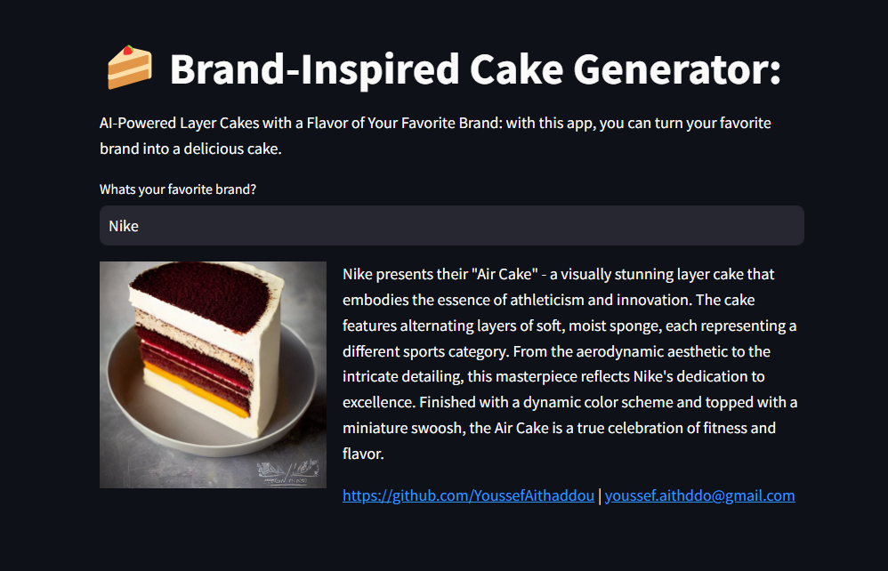

# AI Brand-Inspired Cake Generator

## Overview

Combining text-to-image with Large Language models, the AI Brand-Inspired Cake Generator is an interactive application that allows users to transform their favorite brands into visually captivating and delicious layer cakes. This project seamlessly blends the worlds of high fashion and culinary artistry by leveraging AI technologies, including Stable Diffusion and OpenAI's GPT-3.5 Turbo.

## Features

- **Brand Input:** Users can input the name of their favorite brand, setting the creative direction for their brand-inspired cake.

- **AI-Generated Descriptions:** The application uses Chat GPT API to generate enticing descriptions of the cakes, capturing the essence of the chosen brands.

- **Visual Masterpieces:** Stable Diffusion transforms the generated descriptions into ultra-realistic 4K images, adorned with the brand's colors, design, and logo.

- **Streamlit Interface:** The results are displayed using Streamlit, providing users with an engaging and interactive experience.

- **Customizable and Shareable:** Users can share their brand-inspired cakes with friends, offering a unique blend of fashion and flavor.

## How it Works

1. Input your favorite brand's name.
2. Watch as Chat GPT API creates a description of the cake.
3. That description is used by Stable Diffusion to generate a photo of the product.
4. The picture and description are then displayed using Streamlit.

